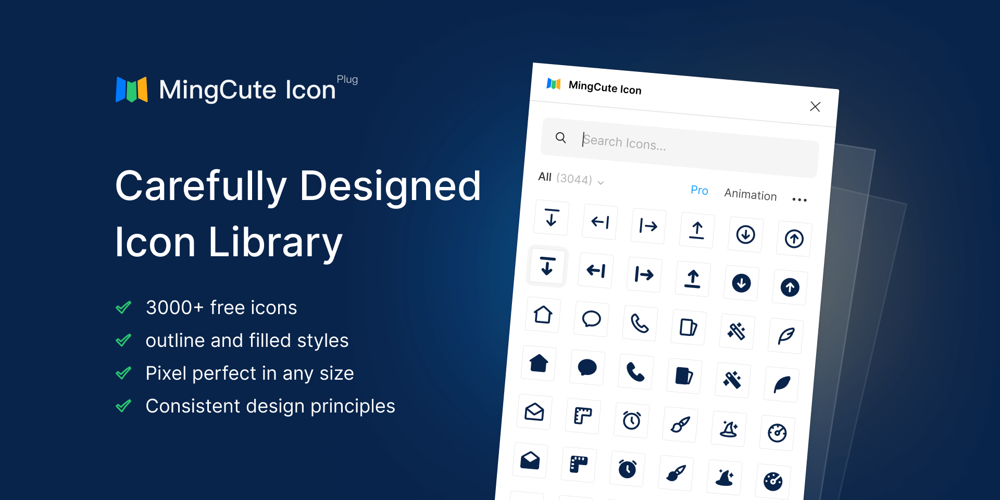
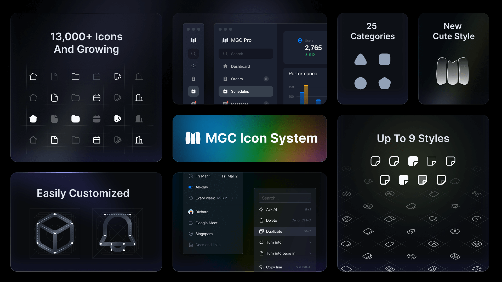

# Blade Mingcute Icons

<p align="center">
    
</p>

<p align="center">
    <a href="https://github.com/blade-ui-kit/blade-mingcute-icons/actions?query=workflow%3ATests">
        
    </a>
    <a href="https://packagist.org/packages/blade-ui-kit/blade-mingcute-icons">
        
    </a>
    <a href="https://packagist.org/packages/blade-ui-kit/blade-mingcute-icons">
        
    </a>
</p>

A package to easily use the MingCute Icons in your Laravel Blade views.
For a full list of available icons, see [the SVG directory](resources/svg) or preview them at [Mingcute.com](https://mingcute.com).

## Requirements

- PHP 8.1 or higher
- Laravel 9.0 or higher

## Installation

```bash
composer require blade-ui-kit/blade-mingcute-icons
```

## Blade Icons

Blade Mingcute Icons uses Blade Icons under the hood. Please refer to [the Blade Icons readme](https://github.com/blade-ui-kit/blade-icons) for additional functionality. We also recommend to [enable icon caching](https://github.com/blade-ui-kit/blade-icons#caching) with this library.

## Usage

Icons can be used as self-closing Blade components which will be compiled to SVG icons:

```blade
<x-mingcute-development.code />
<x-mingcute-development.code-fill />
```

You can also pass classes to your icon components:

```blade
<x-mingcute-development.code-fill class="w-6 h-6 text-gray-500" />
```

And even use inline styles:

```blade
<x-mingcute-development.code-fill style="color: #555" />
```

### Raw SVG Icons

If you want to use the raw SVG icons as assets, you can publish them using:

```bash
php artisan vendor:publish --tag=blade-mingcute-icons --force
```

Then use them in your views like:

```blade

```

## Figma Plug

[](https://www.figma.com/community/plugin/1306884809438005528/mingcute-icon)

[MingCute Icons Figma plugin](https://www.figma.com/community/plugin/1306884809438005528/mingcute-icon)

## MGC Icon System

[](https://mgc.mingcute.com)

[MGC Icon System](https://mgc.mingcute.com) is a comprehensive collection of over 13,600 high-quality vector icons across nine styles: cute light, cute regular, cute filled, sharp, light, regular, filled, duotone, and two-tone.It is an upgraded version of MingCute.

## Animation

[](https://www.mingcute.com/animation)

[MingCute animation icons pack](https://www.mingcute.com/animation), which is a meticulously designed library of animated icons featuring lifelike lottie animations.

## Changelog

Check out the [CHANGELOG](CHANGELOG.md) in this repository for all the recent changes.

## Maintainers

Blade Mingcute Icons is developed and maintained by Chris Oprea.

## License

Blade Mingcute Icons is open-sourced software licensed under [the MIT license](LICENSE.md).